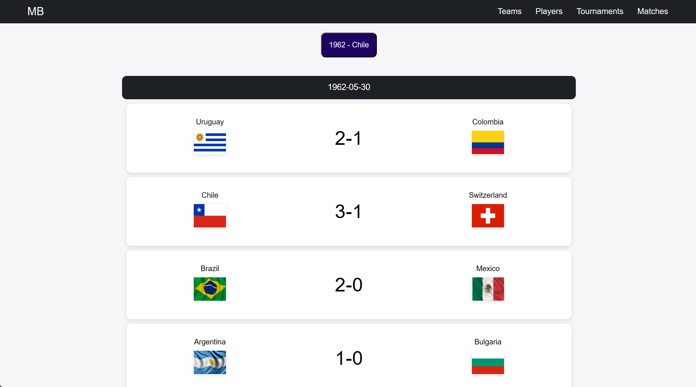
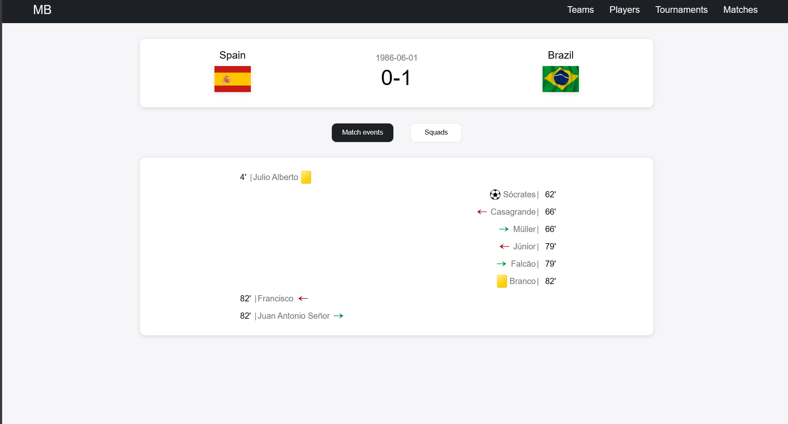
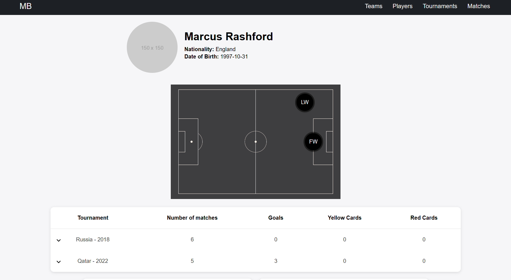
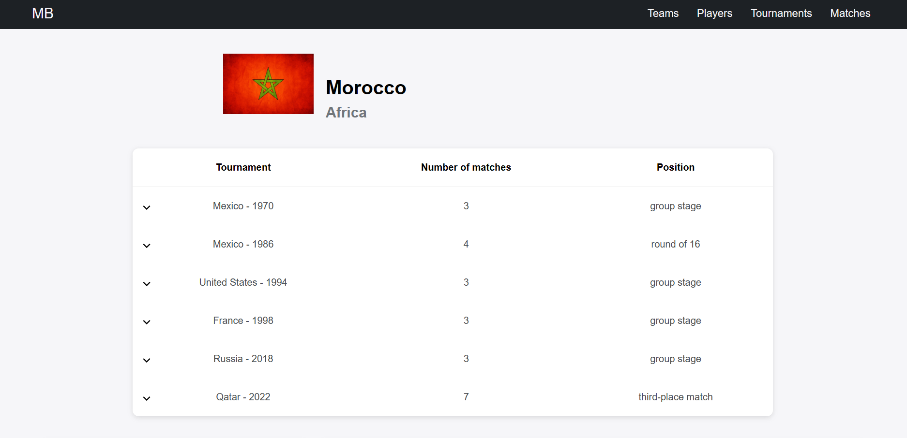

# World Cup Dashboards

This is a web application inspired by some fantastic services like [Sofascore](https://sofascore.com), [Flashscore](https://flashscore.com). It presents some football statistics about World Cup tournaments between year 1930 and 2022 (on the day of writing these words, this is every tournament that happened).

## Dataset
The core and most important thing in this project is historical data about football matches and players. The dataset originally comes from another [Github repository](https://github.com/jfjelstul/worldcup). Thanks to Joshua C. Fjelstul who performed the data scrapping and published a dataset under a CC-BY-SA 4.0 license.

## Tech Stack
**Database**: MySql 8.0  
**Backend**: Python Flask framework (to see all libraries used, please check a *requirements.txt* file)  
**Frontend**: HTML Jinja Templates, CSS, JS  
**DevOps**: Docker

## Live demo
*Not available yet*

## Screenshots

.png)

## How to run?

To run the project you should have a [Docker](https://www.docker.com/) already installed on your machine.

First, to build the project, run a the following commend in a docker console:

``docker compose up --build``

The docker will use docker-compose.ylm and two dockerfiles stored in this repository. First dockerfile (in a root directory of project) is used for installing python and its all required dependencies and finally for running flask server.

Second dockerfile (which is stored in *./db* directory) is used for creating and building a database - it pulls MySQL image from dockerhub, then runs script to create tables, stored procedures and functions.

After building project you need to run a data import. The command below performs easy ETL process - it runs another python script to tranform and import data from csv files into a database. It needs an ID of container created in previous step, you can get it by running ``docker ps`` in a console.

``docker exec <container_id> python DataImporting/files/run_data_import``